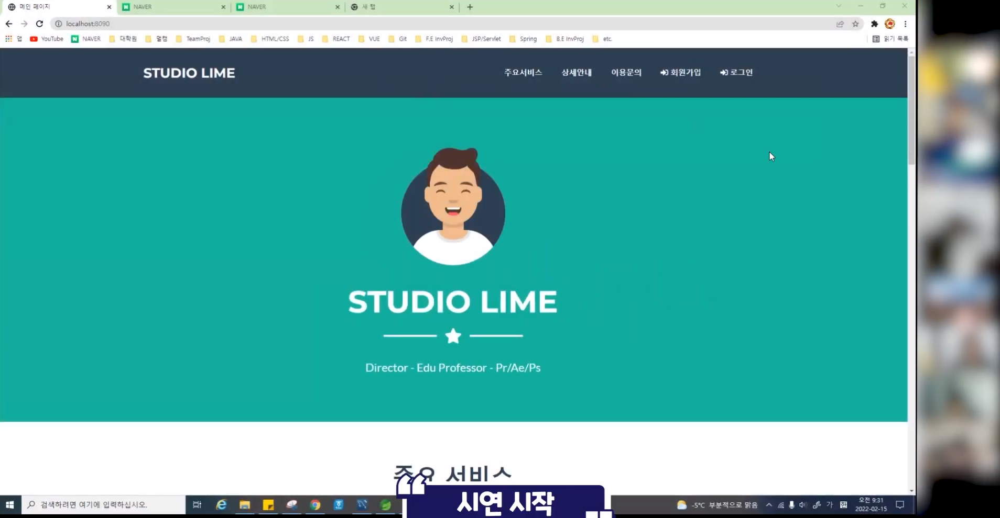

# Introduction to STUDIO LIME

## What is STUDIO LIME?
- 온라인 교육업계 종사자(촬영, 편집자)의 유연한 고용환경 조성
  - 특정 기업에 의존적인 비대칭적 고용형태 해결 
- 신입 강사들에 대한 높은 수준의 온라인 컨텐츠 제작 환경 제공의 기회
  - 메이저 강사 이외 신입 강사들에게도 고품질 온라인 강의 제작 환경을 제공
- 궁극적으로 최종 소비자인 학생들에게 합리적인 온라인 강의 컨텐츠 제공에 기여
  - 온라인 교육시장의 완전경쟁시장 환경을 구축하여 최종 소비자로의 선순환 기대
 

# Demo
 

 
 

# Function Architecture

 <b>메인, 회원, 마이페이지, 프리랜서 신청, 관리자</b> 

 
 

# Class Architecture

 <b>메인, 멤버, 프리랜서 신청, 고객문의</b> 

 

 <b>마이페이지, 관리자페이지</b> 

 
 

# Database Schema

 <b>회원</b> 

 

 <b>프리랜서 신청</b> 

 

 <b>고객문의</b> 

 
 

# Skill & Tools

 <b>Back-end</b> 

* JAVA SE-11
* Spring Boot
* Spring MVC
* Tomcat

 

 <b>Front-end</b> 

* HTML5
* CSS
* JavaScript
* jQuery
* BootStrap5

 

 <b>DBMS</b> 

* MySQL

 

 <b>DevOps</b> 

* Git/GitHub

 

 <b>API & Library</b> 

* Naver SMTP
  

